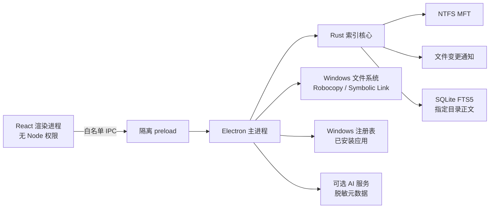
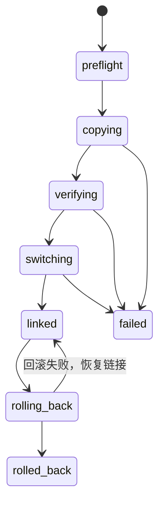

# CDriveShiftAI 架构说明

## 进程与权限边界



渲染进程使用 `contextIsolation` 和 `sandbox`，没有 `nodeIntegration`。所有路径、URL、搜索参数和迁移确认都在主进程再次校验。

## 名称索引

Rust 核心通过 JSON Lines 与 Electron 保持一个长连接。

初始索引：

1. 枚举本地固定盘和可移动本地盘；
2. 对每个 NTFS 卷尝试 `FSCTL_ENUM_USN_DATA` 枚举 MFT 文件记录；
3. 根据文件引用号和父引用号重建完整路径；
4. 对无法使用 MFT 的卷启动 2–8 个并行目录扫描线程；
5. 写入自定义二进制缓存，并用只读内存映射访问完整路径；
6. 内存仅保留紧凑路径偏移、基础元数据、排序后的路径哈希和固定大小名称签名。

普通名称查询先扫描连续的 64 位名称签名，过滤后才按需读取映射路径并做多关键词验证与相关性排序。盘符/目录范围、文件类别和扩展名在 Rust 候选阶段组合过滤；完整路径、区分大小写、完整单词和正则模式由同一查询核心处理。短于 3 个字符、正则或完整路径查询需要扫描更多条目，因此成本高于普通名称查询。

MFT/USN 名称记录本身不提供可直接复用的递归目录大小。Electron 主进程会为首批搜索结果并发读取文件元数据，并在结果出现后用受限后台任务统计文件夹大小；不跟随符号链接，设有目录数量和 25 秒上限，不完整结果在界面以 `≥` 标记。这样目录大小不会阻塞名称查询。

初始索引完成后，Rust 使用 Windows 递归文件变更通知处理创建、删除、改名和移动。新移入的目录会做受限子树补扫；后续主动刷新会压实可能增长的增量条目。

删除单个文件时通过排序路径哈希和小型增量哈希表直接失效对应条目；删除或改名大型目录时按需核对完整路径。实时新增路径写入独立字节池，不修改只读缓存映射。

Electron 会把主窗口和独立搜索窗口的可见性同步给 Rust。所有窗口隐藏或最小化时，MFT 枚举、并行降级扫描、缓存装载、名称签名构建、内容索引和递归变更处理都会在安全检查点暂停；任意工作窗口恢复后继续。进入后台时还会释放可重新从映射文件装入的工作集页。

## 内容索引

内容索引与全盘名称索引分离，避免默认读取所有文件正文。

- 每个用户选择的根目录映射到独立 SQLite 数据库；
- 使用 FTS5 `trigram` tokenizer；
- 多线程读取候选文本，单写入线程在事务中批量提交；
- 新索引先写入临时数据库，完成后原子替换旧数据库；
- UTF-8 和带 BOM 的 UTF-16 文本可识别；
- 含 NUL 的二进制、超过 8 MB 的文件和重解析点会跳过；
- 默认跳过 `node_modules`、`.git`、`dist`、`build`、`target`、缓存与虚拟环境等依赖或生成目录；
- 索引完成后执行 FTS5 `optimize`，合并内部段并压实查询结构。

## 项目数据根目录

所有持久化状态都统一放在 `.cdriveshiftai-data`，不使用 Electron 默认的
`%APPDATA%\CDriveShiftAI`：

```text
<项目根目录>\.cdriveshiftai-data
├── search-index-v1.bin       全盘名称索引
├── content-indexes\          指定目录内容索引
├── cdriveshiftai-state.json  配置、搜索工作区与迁移事务
├── session-data\             Chromium 会话数据
├── logs\
├── crash-dumps\
└── temp\
```

开发版向上解析项目根目录；位于当前项目 `release-ready` 下的目录版和便携版共享该目录。
独立部署时使用可执行文件所在目录，也可以通过 `CDRIVESHIFTAI_DATA_DIR` 指定绝对位置。
程序在创建窗口前重设 Electron 的 `userData`、`sessionData`、日志、崩溃转储和临时目录。

搜索工作区以受限结构写入 `cdriveshiftai-state.json`，包括模式、关键词、筛选、排序、内容范围、最多 500 条结果和当前选中项。渲染进程使用 450 ms 防抖保存，页面卸载时再提交一次最新快照；主进程会限制字符串长度、数组数量并清洗枚举值，避免损坏或异常状态被直接载入。

## 界面与主题分层

三套主题使用同一套功能组件，不在业务视图中复制主题分支：

- `src/lib/effects.ts` 保存主题名称、预览色与启动背景等元数据；
- `data-effect` 与 CSS 变量控制组件材质、边框、菜单、提示和属性窗口；
- `BackgroundFX` 只负责低交互成本的 Canvas 场景；
- Electron 主进程只同步原生窗口背景和标题栏颜色，避免启动时先出现错误主题；
- 搜索分类、书签签名和正则校验等纯逻辑位于 `src/lib/search.ts`，与  React 视图和图标解耦。

启动数据使用相互独立的容错加载，某一项读取失败不会阻止其他设置、索引状态或历史记录恢复。主题保存使用请求序号丢弃过期响应，避免快速切换时较慢的旧请求覆盖最后选择。

## 归属分析

本地候选得分来自：

- 目录是否与注册表 `InstallLocation` 重合；
- 路径 token 与应用名/发布者 token 的重合；
- AppData、Cache、Temp、Program Files、开发依赖和用户库规则；
- 扩展名、文件数、子目录数与空间分布。

AI 接收本地结果和受控元数据，仅能让结论更保守，不能把本地 `blocked` 改成可迁移。主进程统一实现三种协议适配：OpenAI 兼容的 `/models` 与 `/chat/completions`、Anthropic 的 `/models` 与 `/messages`、Gemini 的 `/models` 与 `:generateContent`。厂商预设只提供默认协议和 Base URL，用户仍可修改 URL。

API Key 不进入普通设置更新通道，也不会返回给渲染进程。模型发现、测试对话和实际归属分析都在主进程完成；测试成功后生成与厂商、协议、URL、模型及 Key 指纹绑定的短时一次性验证标识。只有指纹完全一致的配置可以保存，任意连接字段变化都会要求重新测试。Key 最终由 Electron `safeStorage` 加密后写入项目数据根目录中的状态文件。

磁盘归属地图使用轻量级目录扫描，不递归统计容量。它枚举盘符根目录、程序安装容器、ProgramData、当前用户目录和 AppData，并一次性对照卸载注册表与 AppX/MSIX 包记录。应用名匹配只使用目录 basename 与去除通用词后的显著 token，避免 `tool`、`app`、`Windows` 等通用词造成大面积误归属；详细容量与扩展名画像由单目录分析页面按需完成。

## 迁移状态机



每次阶段变化都会先写入项目数据根目录中的 JSON 事务记录，再通知界面。状态文件采用“临时文件 + 重命名”的方式更新。

切换阶段使用源目录同级备份名，确保原路径所在卷上的重命名是原子的。符号链接建立并验证成功后才删除旧副本。若切换中途失败，则移除不完整链接并把同级备份重命名回源路径。

## 已知边界

- 读取原始 NTFS 卷通常需要管理员权限；无权限时会自动使用并行扫描，第一次全盘建索引会更慢；
- 内容索引当前由用户显式刷新，不默认实时读取正文变化；
- 迁移无法保证厂商更新器、驱动或服务支持符号链接，因此应用安装目录始终显示高风险；
- 文件级内容预览只展示索引片段，不解析 Office、PDF 或压缩包；
- 安装包需要发布者自己的 Authenticode 证书才能消除 SmartScreen 的“未知发布者”提示。
